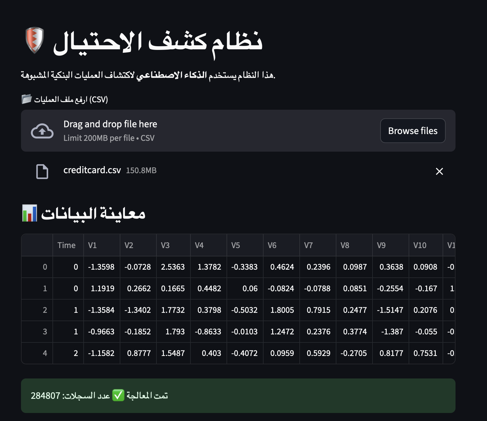
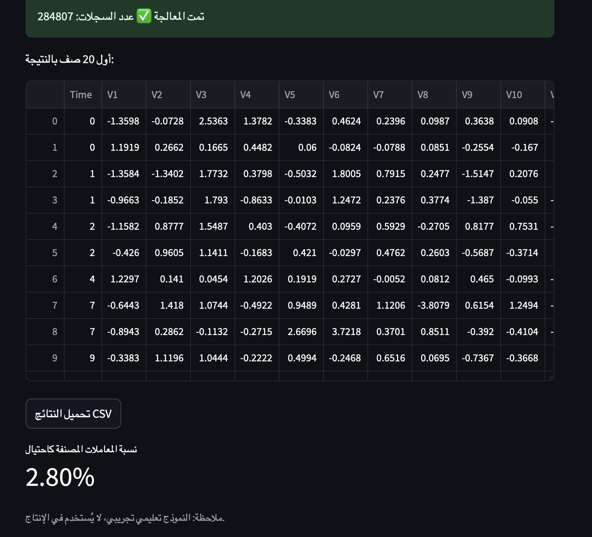

# 🛡️ Fraud Detection System (Demo)
[](https://fraudproject-dteaj5t8y7zjuxsjnovgdf.streamlit.app/)

مشروع عملي لتطبيق تقنيات **الذكاء الاصطناعي** في مجال **الأمن السيبراني**، يهدف إلى كشف المعاملات البنكية الاحتيالية.  
تم بناء النموذج باستخدام **Machine Learning** (Logistic Regression) ونشره عبر **Streamlit Cloud** بحيث يمكن تجربته مباشرة من المتصفح.

---

## ✨ المزايا
- 🧠 **خوارزمية ذكية**: Logistic Regression مع موازنة لفئات البيانات (class_weight='balanced').  
- 📊 **تقييم الأداء**: ROC-AUC و Classification Report.  
- 🌐 **واجهة سهلة**: Streamlit لرفع ملفات CSV وتحليلها مباشرة.  
- ⚡ **نشر مباشر**: التطبيق متاح أونلاين عبر [Streamlit Cloud](https://fraudproject-dteaj5t8y7zjuxsjnovgdf.streamlit.app/).

---
## 📦 البيانات
تم استخدام Credit Card Fraud Dataset من Kaggle.
ملاحظة: ملف البيانات غير مرفوع للمستودع (مسجّل في .gitignore).
المستخدم يستطيع رفع ملف CSV مشابه عبر واجهة التطبيق.

---
## 🖼️ صور من التطبيق

### رفع البيانات ومعاينتها


### النتائج وتحليل المعاملات



---

## ⚠️ تنبيه
المشروع تجريبي لغرض التعلم والتدريب فقط، وليس نظامًا إنتاجيًا


## 👩‍💻 معلومات
الكاتبة: Lubna Saeed
GitHub Repo: fraud_project
Live Demo: Streamlit App

## 🚀 كيفية التشغيل محليًا
لتشغيل المشروع على جهازك:

```bash
# 1. إنشاء بيئة افتراضية
python3 -m venv .venv
source .venv/bin/activate

# 2. تثبيت المكتبات
pip install -r requirements.txt

# 3. تدريب النموذج (يولد ملفات joblib)
python3 train.py

# 4. تشغيل التطبيق
streamlit run app.py